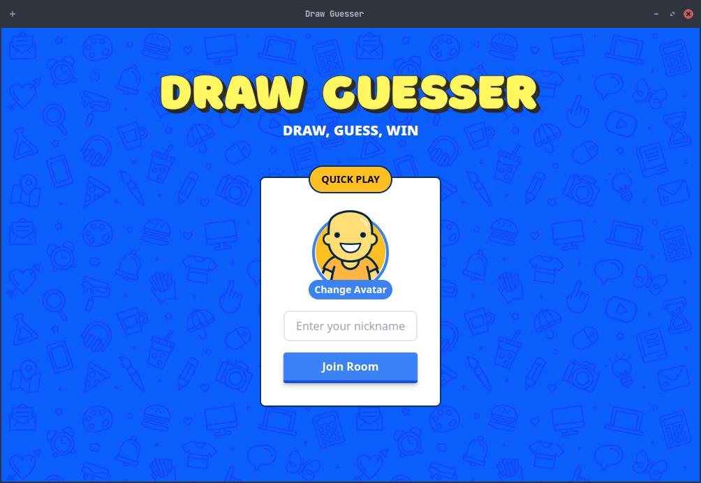
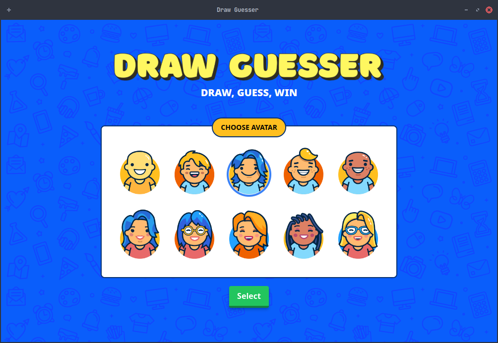
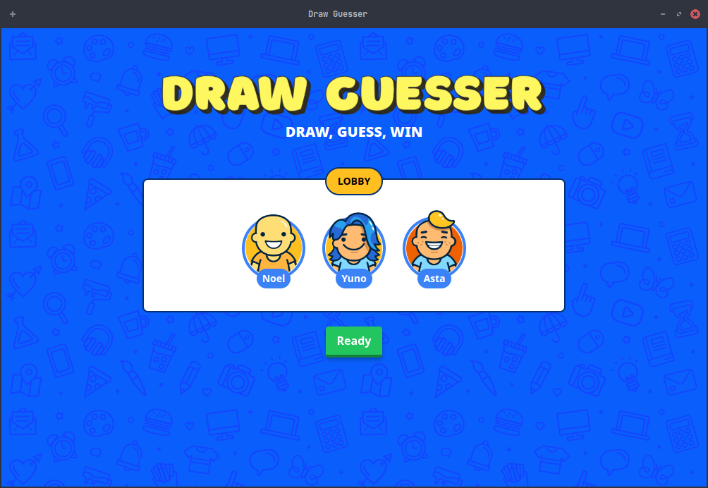
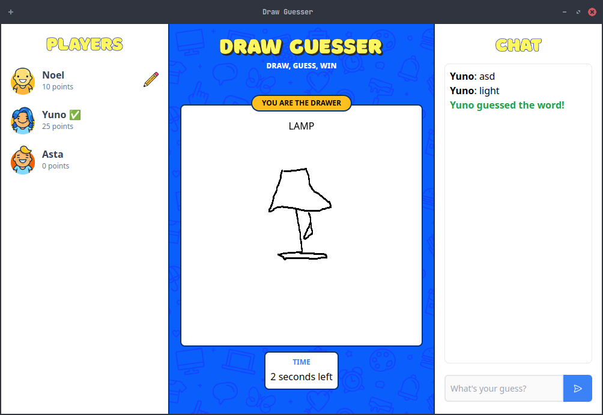
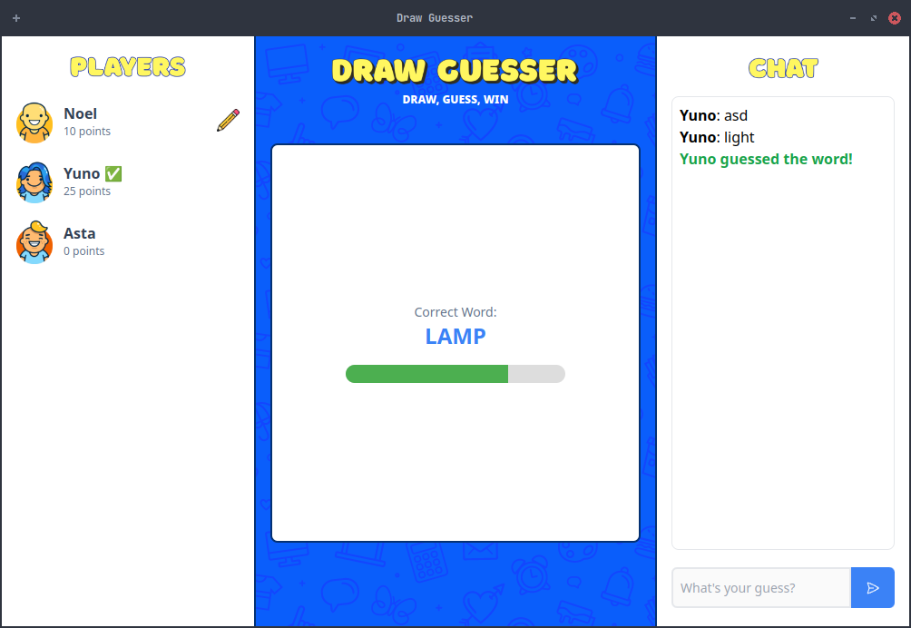
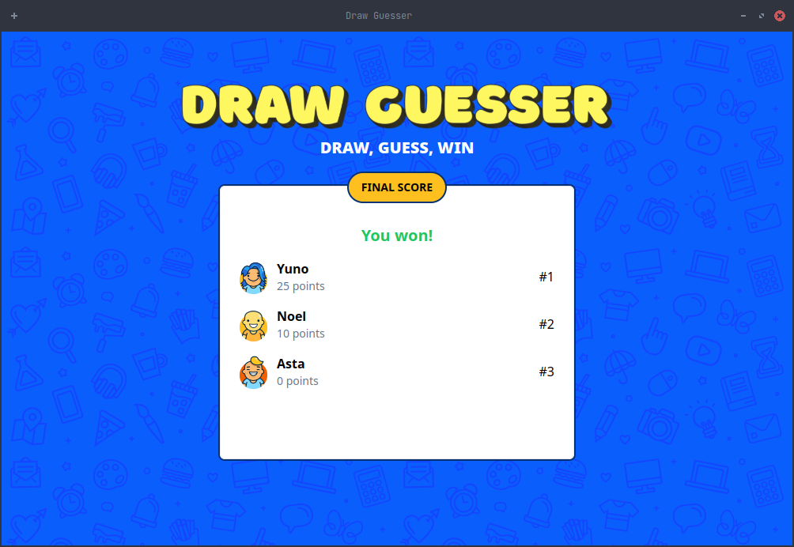

# Draw Guesser
Multiplayer Draw Guessing Game using Sockets. Built using Electon, React, Net library.

# Preview

| Main Menu |
|----------|
||

| Avatar Selection |
|----------|
||

| Lobby |
|----------|
||

| Main Game |
|----------|
||

| Word Reveal (Every End of Turn) |
|----------|
||

| Final Scores |
|----------|
||

# Credits
I do not own some of the assets in this game such as the avatars and the background pattern. It was taken from [gartic.io](https://gartic.io/), which is also an online draw guessing game. Credits to them.
